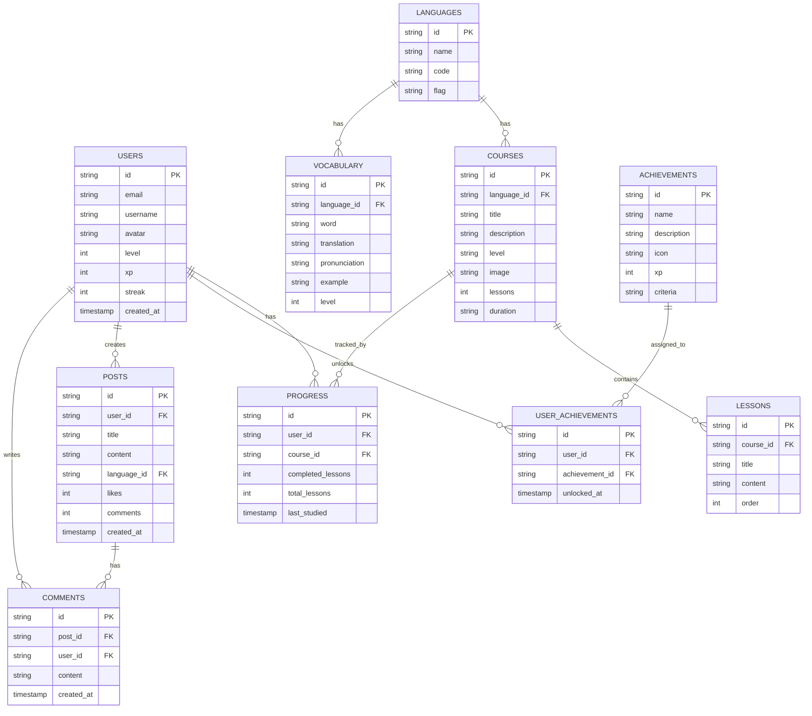

# 多语种学习平台技术架构文档

## 1. Architecture Design

```mermaid
graph TB
    subgraph Frontend
        A[React 18]
        B[React Router]
        C[Tailwind CSS]
        D[Zustand]
        E[Lucide Icons]
    end

    subgraph Backend
        F[Express.js]
        G[Supabase Client]
    end

    subgraph Data
        H[Supabase Auth]
        I[Supabase Database]
    end

    A --&gt; B
    A --&gt; C
    A --&gt; D
    A --&gt; E
    A --&gt; G
    G --&gt; H
    G --&gt; I
```

## 2. Technology Description
- Frontend: React@18 + TypeScript + TailwindCSS@3 + Vite
- Initialization Tool: vite-init
- Backend: Express@4 + TypeScript (optional, for server-side logic)
- Database & Auth: Supabase (PostgreSQL + Auth)
- State Management: Zustand
- Icons: Lucide React
- Charts: Recharts (for data visualization)

## 3. Route Definitions

| Route | Purpose |
|-------|---------|
| / | 首页 |
| /courses | 课程中心 |
| /courses/:id | 课程详情页 |
| /learn | 学习中心 |
| /learn/vocabulary | 单词记忆 |
| /learn/grammar | 语法练习 |
| /learn/speaking | 口语跟读 |
| /learn/listening | 听力训练 |
| /progress | 进度中心 |
| /community | 社区 |
| /community/:id | 帖子详情 |
| /profile | 个人中心 |
| /login | 登录页 |
| /register | 注册页 |

## 4. API Definitions (Backend using Express + Supabase)

### 4.1 Type Definitions

```typescript
// User
interface User {
  id: string;
  email: string;
  username: string;
  avatar?: string;
  level: number;
  xp: number;
  streak: number;
  createdAt: string;
}

// Language
interface Language {
  id: string;
  name: string;
  code: string; // en, ja, ko
  flag: string;
}

// Course
interface Course {
  id: string;
  languageId: string;
  title: string;
  description: string;
  level: 'beginner' | 'intermediate' | 'advanced';
  image: string;
  lessons: number;
  duration: string;
}

// Lesson
interface Lesson {
  id: string;
  courseId: string;
  title: string;
  content: string;
  order: number;
}

// Vocabulary
interface Vocabulary {
  id: string;
  languageId: string;
  word: string;
  translation: string;
  pronunciation: string;
  example: string;
  level: number;
}

// Progress
interface Progress {
  id: string;
  userId: string;
  courseId: string;
  completedLessons: number;
  totalLessons: number;
  lastStudied: string;
}

// Achievement
interface Achievement {
  id: string;
  name: string;
  description: string;
  icon: string;
  xp: number;
  criteria: string;
}

// UserAchievement
interface UserAchievement {
  id: string;
  userId: string;
  achievementId: string;
  unlockedAt: string;
}

// Post
interface Post {
  id: string;
  userId: string;
  title: string;
  content: string;
  languageId: string;
  likes: number;
  comments: number;
  createdAt: string;
}

// Comment
interface Comment {
  id: string;
  postId: string;
  userId: string;
  content: string;
  createdAt: string;
}
```

## 5. Server Architecture Diagram (Express Backend)

```mermaid
graph TB
    A[Client] --&gt; B[Express Server]
    B --&gt; C[Auth Middleware]
    C --&gt; D[Controllers]
    D --&gt; E[Supabase Client]
    E --&gt; F[Supabase Database]
    E --&gt; G[Supabase Auth]
```

## 6. Data Model

### 6.1 Data Model Definition



### 6.2 Data Definition Language

```sql
-- Enable UUID extension
create extension if not exists "uuid-ossp";

-- Users table
create table users (
    id uuid default uuid_generate_v4() primary key,
    email text unique not null,
    username text not null,
    avatar text,
    level int default 1,
    xp int default 0,
    streak int default 0,
    created_at timestamp default now()
);

-- Languages table
create table languages (
    id uuid default uuid_generate_v4() primary key,
    name text not null,
    code text unique not null,
    flag text not null
);

-- Courses table
create table courses (
    id uuid default uuid_generate_v4() primary key,
    language_id uuid references languages(id),
    title text not null,
    description text,
    level text check (level in ('beginner', 'intermediate', 'advanced')),
    image text,
    lessons int default 0,
    duration text
);

-- Lessons table
create table lessons (
    id uuid default uuid_generate_v4() primary key,
    course_id uuid references courses(id),
    title text not null,
    content text,
    "order" int not null
);

-- Vocabulary table
create table vocabulary (
    id uuid default uuid_generate_v4() primary key,
    language_id uuid references languages(id),
    word text not null,
    translation text not null,
    pronunciation text,
    example text,
    level int default 1
);

-- Progress table
create table progress (
    id uuid default uuid_generate_v4() primary key,
    user_id uuid references users(id),
    course_id uuid references courses(id),
    completed_lessons int default 0,
    total_lessons int default 0,
    last_studied timestamp default now()
);

-- Achievements table
create table achievements (
    id uuid default uuid_generate_v4() primary key,
    name text not null,
    description text,
    icon text,
    xp int default 0,
    criteria text
);

-- User Achievements table
create table user_achievements (
    id uuid default uuid_generate_v4() primary key,
    user_id uuid references users(id),
    achievement_id uuid references achievements(id),
    unlocked_at timestamp default now(),
    unique(user_id, achievement_id)
);

-- Posts table
create table posts (
    id uuid default uuid_generate_v4() primary key,
    user_id uuid references users(id),
    title text not null,
    content text,
    language_id uuid references languages(id),
    likes int default 0,
    comments int default 0,
    created_at timestamp default now()
);

-- Comments table
create table comments (
    id uuid default uuid_generate_v4() primary key,
    post_id uuid references posts(id),
    user_id uuid references users(id),
    content text not null,
    created_at timestamp default now()
);

-- Enable Row Level Security (RLS)
alter table users enable row level security;
alter table languages enable row level security;
alter table courses enable row level security;
alter table lessons enable row level security;
alter table vocabulary enable row level security;
alter table progress enable row level security;
alter table achievements enable row level security;
alter table user_achievements enable row level security;
alter table posts enable row level security;
alter table comments enable row level security;

-- Policies
create policy "Public languages are viewable by everyone"
    on languages for select using (true);

create policy "Public courses are viewable by everyone"
    on courses for select using (true);

create policy "Public lessons are viewable by everyone"
    on lessons for select using (true);

create policy "Public vocabulary is viewable by everyone"
    on vocabulary for select using (true);

create policy "Achievements are viewable by everyone"
    on achievements for select using (true);

create policy "Users can view their own data"
    on users for select using (auth.uid() = id);

create policy "Users can update their own data"
    on users for update using (auth.uid() = id);

create policy "Users can manage their own progress"
    on progress for all using (auth.uid() = user_id);

create policy "Users can manage their own achievements"
    on user_achievements for all using (auth.uid() = user_id);

create policy "Posts are viewable by everyone"
    on posts for select using (true);

create policy "Users can create posts"
    on posts for insert with check (auth.uid() = user_id);

create policy "Users can update their own posts"
    on posts for update using (auth.uid() = user_id);

create policy "Users can delete their own posts"
    on posts for delete using (auth.uid() = user_id);

create policy "Comments are viewable by everyone"
    on comments for select using (true);

create policy "Users can create comments"
    on comments for insert with check (auth.uid() = user_id);

create policy "Users can update their own comments"
    on comments for update using (auth.uid() = user_id);

create policy "Users can delete their own comments"
    on comments for delete using (auth.uid() = user_id);

-- Grant permissions
grant select on languages to anon, authenticated;
grant select on courses to anon, authenticated;
grant select on lessons to anon, authenticated;
grant select on vocabulary to anon, authenticated;
grant select on achievements to anon, authenticated;
grant select on posts to anon, authenticated;
grant select on comments to anon, authenticated;

grant all on users to authenticated;
grant all on progress to authenticated;
grant all on user_achievements to authenticated;
grant all on posts to authenticated;
grant all on comments to authenticated;

-- Insert initial data
insert into languages (name, code, flag) values
('英语', 'en', '🇺🇸'),
('日语', 'ja', '🇯🇵'),
('韩语', 'ko', '🇰🇷');

insert into achievements (name, description, icon, xp, criteria) values
('新手上路', '完成第一次学习', 'star', 50, 'complete_first_lesson'),
('学习达人', '连续学习7天', 'fire', 200, 'streak_7_days'),
('词汇大师', '掌握500个单词', 'book', 500, 'vocabulary_500');
```

