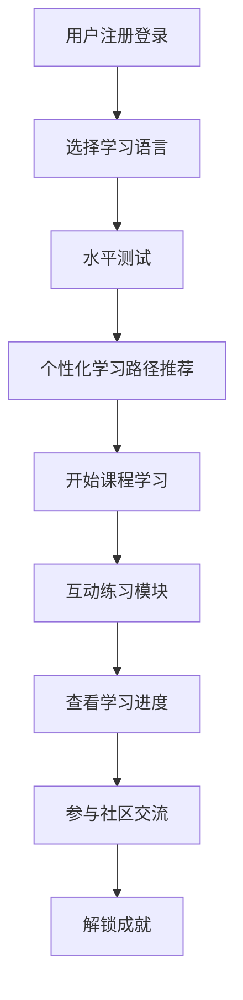

# 多语种学习平台产品需求文档

## 1. Product Overview
一款支持多语种学习的在线教育平台，涵盖英语、日语、韩语等主流语言，为用户提供沉浸式学习体验，包括分级课程、互动练习、进度追踪、个性化推荐和社区交流功能。

## 2. Core Features

### 2.1 User Roles
| Role | Registration Method | Core Permissions |
|------|---------------------|------------------|
| 用户 | 邮箱注册/第三方登录 | 浏览课程、使用学习模块、追踪进度、参与社区、获得成就 |

### 2.2 Feature Module
1. **首页**: 课程展示、学习推荐、社区动态
2. **课程中心**: 分级课程体系、语言选择、课程详情
3. **学习中心**: 单词记忆、语法练习、口语跟读、听力训练
4. **进度中心**: 学习数据统计、学习轨迹、目标设定
5. **社区**: 话题讨论、学习分享、用户互动
6. **个人中心**: 用户信息、成就展示、设置

### 2.3 Page Details
| Page Name | Module Name | Feature description |
|-----------|-------------|---------------------|
| 首页 | Hero区域 | 平台特色展示、快速开始入口、语言选择 |
| 首页 | 课程推荐 | 个性化课程推荐、热门课程列表 |
| 首页 | 学习动态 | 今日学习、社区热门话题 |
| 课程中心 | 语言分类 | 英语、日语、韩语等语言切换 |
| 课程中心 | 课程列表 | 分级课程展示、难度筛选、课程详情页 |
| 学习中心 | 单词记忆 | 闪卡模式、拼写练习、复习提醒 |
| 学习中心 | 语法练习 | 互动习题、即时反馈、知识点解析 |
| 学习中心 | 口语跟读 | 录音功能、发音评分、练习记录 |
| 学习中心 | 听力训练 | 音频播放、听力题目、进度控制 |
| 进度中心 | 数据面板 | 学习时长、完成课程、词汇量统计 |
| 进度中心 | 学习轨迹 | 日历视图、学习记录、连续打卡 |
| 社区 | 话题列表 | 热门话题、最新讨论、分类筛选 |
| 社区 | 帖子详情 | 内容展示、评论区、点赞收藏 |
| 个人中心 | 成就系统 | 徽章展示、成就解锁、排名查看 |
| 个人中心 | 用户信息 | 头像昵称、学习目标、设置选项 |

## 3. Core Process
用户注册登录 → 选择学习语言 → 进行水平测试 → 获得个性化学习路径 → 开始课程学习 → 使用互动练习 → 查看学习进度 → 参与社区交流 → 解锁成就

## 4. User Interface Design
### 4.1 Design Style
- 主色调：渐变蓝色系 (#3B82F6 到 #6366F1)，传达学习和专业感
- 辅助色：温暖橙色 (#F59E0B) 用于强调和互动元素
- 按钮风格：圆角矩形，带有微妙的阴影和悬停动画
- 字体：使用 Playfair Display 作为标题字体，Noto Sans 作为正文字体，支持多语言字符
- 布局风格：卡片式设计，层次清晰，留有充足的呼吸空间
- 图标：线条简洁的线性图标，搭配温和的色彩

### 4.2 Page Design Overview
| Page Name | Module Name | UI Elements |
|-----------|-------------|-------------|
| 首页 | Hero区域 | 渐变背景、大标题、语言选择器、CTA按钮、微妙动画 |
| 首页 | 课程卡片 | 缩略图、课程名称、难度标签、进度条、悬停效果 |
| 学习中心 | 练习界面 | 干净的练习区域、即时反馈提示、进度指示器 |
| 进度中心 | 数据可视化 | 图表展示、统计卡片、时间线布局 |
| 个人中心 | 成就展示 | 徽章墙、解锁动画、进度环 |

### 4.3 Responsiveness
- Desktop-first 设计，响应式适配平板和移动设备
- 触摸优化的交互元素大小和间距
- 导航栏在移动端转换为汉堡菜单

### 4.4 3D Scene Guidance (Not applicable)
